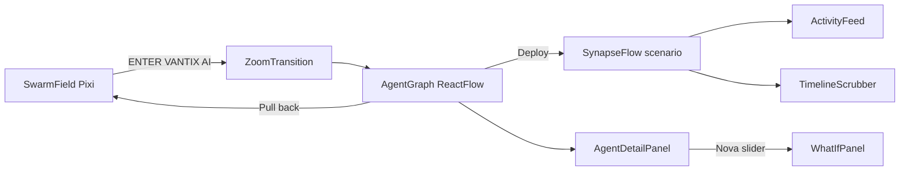

# PROJECT STATE — Veridian

> Onboarding doc for agents and engineers. Read this first, then follow the pointers below for depth.

**Product:** Veridian — Agent Operations Center  
**Customer fiction:** Vantix AI (500 humans / ~600 AI workers)  
**Tagline:** Trust is the infrastructure  
**Repo package name:** `veridian`  
**Last major ship on `main`:** Veridian rename + agent Model/Built-by origins + merge-breakage fixes (`aef3c82`)

---

## What this is

A live, scripted hackathon demo — not a general app. One screen, two scales:

1. **Org swarm** — ambient Pixi field + org-wide metrics (~612 agents)
2. **Cluster** — 5 hero agents in React Flow; scripted SynapseFlow story

The presenter narrates while the UI plays. Core path is offline/local; Create Agent can optionally call OpenAI for personality blurbs via a Vite proxy.

---

## Run

```bash
npm install
npm run dev      # → http://localhost:5173
npm run build
npm run lint     # oxlint
```

**Click path:** Swarm → **ENTER VANTIX AI** → **Deploy agents to investigate** → SynapseFlow (SENTINEL blocks NOVA, trust reweights) → optional Nova what-if / timeline scrub / **Pull back**.

---

## Read these first (extra context)

| Priority | File | Why |
|----------|------|-----|
| 1 | [`demo_script.md`](demo_script.md) | Spoken stage script (~7 min). Parts 1–6, delivery checklist, Ramp policy-agent reframe in Part 3. **Authoritative for what the demo should feel like.** Note: script title may still say “Ramp Identity”; in-app product name is **Veridian**. |
| 2 | [`README.md`](README.md) | One-page run + demo path + stack |
| 3 | [`idea_overview.md`](idea_overview.md) | Strategy / positioning doc (Veridian as financial identity for AI workers; Ramp-as-company sections are intentional) |
| 4 | [`mvp_demo_spec.md`](mvp_demo_spec.md) | Original detailed MVP/demo implementation spec (tracked in git; restore if missing locally: `git checkout HEAD -- mvp_demo_spec.md`) |

---

## Architecture mental model



| Hub | File | Role |
|-----|------|------|
| UI shell | [`src/components/OperationsCenter.tsx`](src/components/OperationsCenter.tsx) | Swarm/cluster modes, zoom, pull-back, composes all panels |
| State | [`src/store/useSimStore.ts`](src/store/useSimStore.ts) | View mode, metrics, scenario, what-if, create agent, scrub, reset |
| Scenario timeline | [`src/engine/scenario_synapseflow.ts`](src/engine/scenario_synapseflow.ts) | Scripted SynapseFlow events + DSL |
| Playback | [`src/engine/eventEngine.ts`](src/engine/eventEngine.ts) | Timed scenario + ambient feed |
| Replay | [`src/engine/replayEngine.ts`](src/engine/replayEngine.ts) | Deterministic scrub 0..N for timeline |
| Types | [`src/engine/types.ts`](src/engine/types.ts) | `Agent`, relationships, events, view modes |
| Hero seed | [`src/data/initialAgents.ts`](src/data/initialAgents.ts) | AURORA / VEGA / SENTINEL / ATLAS / NOVA + layout |
| Tokens | [`src/styles/tokens.ts`](src/styles/tokens.ts) | Colors, fonts, what-if thresholds, zoom duration |

---

## Implemented features (current)

### Core demo loop
- Cold-open swarm with org metrics (StatusBar)
- Zoom into 5-agent cluster with morph/camera transition
- Opportunity card → deploy → SynapseFlow (investigate → correlated risk → SENTINEL block → trust reweight)
- Pull back to org swarm (state preserved when allowed)
- Reset Demo (full cold open)

### Interaction proofs
- **What-if:** raise NOVA spending limit → alternate branch callout (`WhatIfPanel`, `AuthorityControl`, store `applyNovaWhatIf`)
- **Timeline scrubber:** pause and scrub SynapseFlow event index (`TimelineScrubber` + `replayEngine`)
- **Agent detail panel:** trust dims, history chart, authority slider, **Model / Built by**
- **Create agent:** modal + optional OpenAI blurb (`CreateAgentModal`, Vite `/api/agent-reasoning` proxy)

### Branding / narrative
- In-app wordmark **VERIDIAN** ([`StatusBar.tsx`](src/components/StatusBar.tsx))
- Tab title: `Veridian — Agent Operations Center` ([`index.html`](index.html))
- Scale awareness: cluster shows `+N org-wide` under Active Agents
- Hero heterogeneity via `model` + `builtBy` (see table below)

### Hero agents (seed)

| Agent | Role | Model | Built by |
|-------|------|-------|----------|
| AURORA | Executive | Claude | Internal team |
| VEGA | Negotiation | GPT-4 | 3rd-party vendor |
| SENTINEL | Governance | Claude | Internal team |
| ATLAS | Procurement | **Kimi K3** | 3rd-party vendor |
| NOVA | Cost Optimization | GPT-4 | 3rd-party vendor |

Defined in [`src/data/initialAgents.ts`](src/data/initialAgents.ts); shown in [`AgentDetailPanel.tsx`](src/components/AgentDetailPanel.tsx).

---

## Component map (`src/components/`)

| File | Purpose |
|------|---------|
| `OperationsCenter.tsx` | Main shell / flow orchestration |
| `StatusBar.tsx` | VERIDIAN header, metrics, Reset, + Agent |
| `SwarmField.tsx` | Pixi particle swarm |
| `ZoomTransition.tsx` | Morph overlay + zoom transform helper |
| `AgentGraph.tsx` | React Flow cluster canvas |
| `AgentNode.tsx` | Agent card node |
| `RelationshipEdge.tsx` | Relationship edges (incl. severed/block) |
| `OpportunityCard.tsx` | SynapseFlow deploy CTA |
| `ActivityFeed.tsx` | Live event ticker |
| `AgentDetailPanel.tsx` | Selected-agent side panel |
| `AuthorityControl.tsx` | Spending slider |
| `TrustHistoryChart.tsx` | Trust sparkline |
| `WhatIfPanel.tsx` | What-if outcome overlay |
| `TimelineScrubber.tsx` | Scenario scrub UI |
| `CreateAgentModal.tsx` | Create-agent form |

---

## Engine / data / store

| Path | Purpose |
|------|---------|
| `src/engine/types.ts` | Domain types (`Agent` includes `model`, `builtBy`) |
| `src/engine/swarmEngine.ts` | Particle motion / links |
| `src/engine/trustEngine.ts` | Trust updates, money/authority labels |
| `src/engine/eventEngine.ts` | Live scenario + ambient feed |
| `src/engine/replayEngine.ts` | Timeline replay |
| `src/engine/scenario_synapseflow.ts` | SynapseFlow script |
| `src/data/initialAgents.ts` | Hero seeds + `CLUSTER_LAYOUT` |
| `src/data/swarmConfig.ts` | Swarm particle factory / hero center |
| `src/store/useSimStore.ts` | All simulation UI state |

---

## Demo script map (`demo_script.md`)

| Part | Time | Beat |
|------|------|------|
| 1 Cold Open | 0:00–0:45 | Living ops center; “who do you trust with money?” |
| 2 Reframe | 0:45–1:45 | Static permissions fail at AI scale |
| 3 Reveal | 1:45–2:15 | Acknowledge Ramp’s shipped policy agent → org-scale problem → introduce **Veridian** |
| 4 SynapseFlow | 2:15–5:30 | Opportunity → agents → crack → SENTINEL block → reweight |
| 5 What-if | 5:30–6:15 | Prove it’s live (Nova slider) |
| 6 Close | 6:15–7:00 | Pull back; “trust is the infrastructure” |

---

## Tech stack

React 19 · TypeScript · Vite 8 · Tailwind 4 · Zustand · Pixi.js 8 · React Flow 11 · Framer Motion · oxlint

---

## Conventions / gotchas for new agents

1. **Product name is Veridian** in UI/metadata. Keep Ramp only as company/competitor context (demo Part 3, idea overview positioning) — never as the product being demoed.
2. **Don’t break the scripted path.** Changes to `scenario_synapseflow.ts` / `eventEngine.ts` / zoom timing affect live presentation.
3. **Merge conflicts have bitten this repo.** `OperationsCenter`, `StatusBar`, and `SwarmField` previously shipped with duplicate JSX/`const` from bad merges. Prefer clean structural merges.
4. **Vantix AI** = fictional customer org; **Veridian** = product; **Ramp** = real company in the pitch, not the product name.
5. Create Agent + OpenAI proxy are optional polish — core demo must work offline.

---

## Out of scope / not built

- Real money movement / production auth
- Multi-tenant org switcher (UI stub only: “Viewing: Vantix AI”)
- Backend persistence
- Full agent marketplace

---

## Quick “where do I change X?”

| Want to… | Start here |
|----------|------------|
| Change spoken pitch | `demo_script.md` |
| Change hero names/trust/origins | `src/data/initialAgents.ts` |
| Change SynapseFlow story beats | `src/engine/scenario_synapseflow.ts` |
| Change zoom / pull-back UX | `src/components/OperationsCenter.tsx` |
| Change header branding/metrics | `src/components/StatusBar.tsx` |
| Change what-if thresholds | `src/styles/tokens.ts` + `useSimStore.ts` |
| Change detail panel fields | `src/components/AgentDetailPanel.tsx` |
| Change product name chrome | `StatusBar.tsx`, `index.html`, `package.json` |
